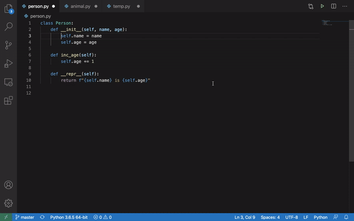

# Renavigate: Multi-clipboard Functions for VSCode

## Description
Easy and intuitive code manipulation is necessary to understand and work with large codebases. Oftentimes, the basic copy and paste clipboard functions aren't sufficient for software development. This extension allows VSCode users to have access to multiclipboard functions.

## Installation
`$ git clone https://github.com/Yiwen-Gao/renavigate.git`

Open the project in VSCode and run the extension. The multi-clipboard functions should be available in the VSCode Extension Development Host.

## Usage
CMD+C (CTRL+C): copy the selected text

CMD+; (CTRL+;): merge the selected text with the most recently copied text

CMD+V (CTRL+V): paste the most recently copied text

CMD+' (CTRL+'): paste the most recently copied text and delete it from the clipboard

## Demo

